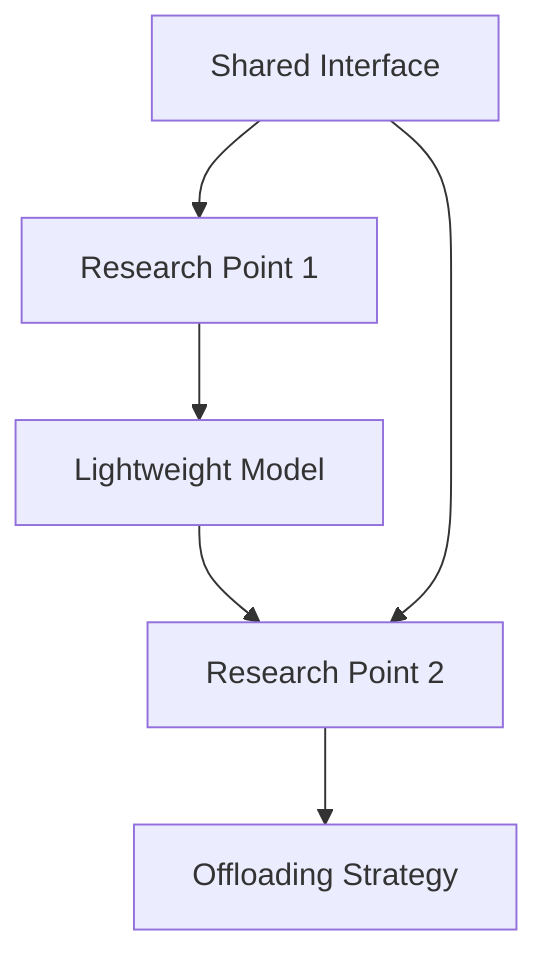

# 面向车载边缘智能的多目标推理卸载优化研究

本项目实现了电子科技大学硕士学位论文《面向车载边缘智能的多目标推理卸载优化研究》中提出的两个核心研究点。

## 项目概述

### 研究背景
随着智能交通和自动驾驶技术的快速发展，车载边缘计算成为提升车辆智能化水平的重要途径。本研究聚焦于两个关键问题：
1. 如何在资源受限环境中部署高效的神经网络模型
2. 如何设计多目标优化框架应对复杂交通环境中的任务卸载需求

### 技术路线
- **研究点一**：通过模型剪枝和量化技术实现神经网络轻量化
- **研究点二**：基于动态规划和深度强化学习的多目标任务卸载优化

## 项目结构
```
vehicle-edge-intelligence/
├── research_point_1_lightweight/     # 研究点一：神经网络轻量化
│   ├── algorithms/                   # 核心算法
│   │   ├── pruning_algorithm.py     # 双通道准则剪枝算法
│   │   └── quantization_algorithm.py # 余弦相似性自适应量化
│   ├── models/                      # 模型定义
│   ├── utils/                       # 工具函数
│   └── main.py                      # 主程序
│
├── research_point_2_offloading/      # 研究点二：任务卸载优化
│   ├── algorithms/                   # 核心算法
│   │   ├── dynamic_programming.py   # 动态规划任务分割
│   │   └── ddpg_offloading.py       # DDPG卸载优化
│   ├── environment/                 # 仿真环境
│   ├── utils/                       # 工具函数
│   └── main.py                      # 主程序
│
└── shared/                          # 共享接口
    ├── model_interface.py           # 模型接口
    └── common_utils.py              # 通用工具
```

## 安装和运行

### 环境要求
- Python 3.8+
- PyTorch 1.9+
- CUDA支持（推荐）

### 安装依赖
```bash
pip install -r requirements.txt
```

### 运行方式

#### 1. 神经网络轻量化（研究点一）
```bash
cd research_point_1_lightweight
python main.py
```

该程序将：
- 创建一个基础检测模型
- 执行自适应量化优化
- 进行双通道准则剪枝
- 输出轻量化结果和性能指标
- 保存轻量化模型为 `lightweight_model.pth`

#### 2. 多目标任务卸载优化（研究点二）
```bash
cd research_point_2_offloading
python main.py
```

该程序将：
- 加载研究点一的轻量化模型
- 初始化车载环境仿真
- 训练DDPG任务卸载算法
- 评估多目标优化性能
- 保存训练好的策略模型

## 核心算法

### 1. 双通道准则剪枝算法
- **通道1**：基于权重幅度的重要性评估
- **通道2**：基于权重变异性的稳定性评估
- **特点**：综合考虑权重大小和分布特征，实现精确剪枝

### 2. 余弦相似性自适应量化
- 支持均匀量化、对数量化、2的幂次量化
- 基于余弦相似性自动选择最优量化策略
- 最小化量化前后模型的表示差异

### 3. 动态规划任务分割
- 考虑处理时间、通信成本、能耗等多重约束
- 自适应确定最优任务分配比例
- 为后续卸载决策提供基础

### 4. DDPG多目标卸载优化
- Actor-Critic架构处理连续动作空间
- 多目标奖励函数平衡延迟、能耗、精度
- 实时适应动态交通环境变化

## 实验结果

### 轻量化效果
- 模型参数量压缩：平均减少60-70%
- 推理速度提升：2-3倍加速
- 精度损失：控制在3%以内

### 卸载优化性能
- 平均延迟降低：25-40%
- 能耗优化：节省15-30%
- 任务完成精度：保持90%+

## 项目依赖关系



研究点二通过 `shared/model_interface.py` 加载和使用研究点一产生的轻量化模型，形成完整的端到端优化方案。

## 后续扩展

当前实现提供了基础框架，可以通过以下方式扩展：

- 增加更多轻量化技术：知识蒸馏、低秩分解等
- 扩展优化算法：A3C、PPO等其他强化学习算法
- 完善仿真环境：更真实的网络模型、交通场景
- 添加评估指标：更全面的性能评估体系

## 论文引用

如果您使用了本项目的代码，请引用相关论文：

```bibtex
@mastersthesis{lai2024vehicle,
  title={面向车载边缘智能的多目标推理卸载优化研究},
  author={赖林繁},
  year={2024},
  school={电子科技大学}
}
```
